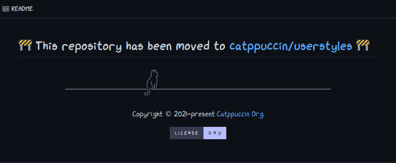

# CAT-0001-Userstyles.md

Date: **2022-02-13**

## Status

| Draft | In Review | Done |
| :---: | --------- | ---- |
|  ☑️    | ☑️         |      |

## Proposed By

<table>
<tr>
    <td align="center"><a href="https://winston.sh/"><br /><sub><b>winston</b></sub></a><br /></td>
    <td align="center"><a href="https://github.com/sgoudham"><br /><sub><b>Hamothy</b></sub></a><br /></td>
    <td align="center"><a href="https://github.com/backwardspy"><br /><sub><b>backwardspy</b></sub></a><br /></td>
</tr>
</table>

## Introduction

As it stands, the Catppuccin project accepts userstyles as their own separate
port request, resulting in a separate GitHub repository. To clarify, userstyles
are simply styles for websites created via
[Stylus](https://addons.mozilla.org/firefox/addon/styl-us/) or
[Stylish](https://addons.mozilla.org/firefox/addon/stylish/).

Catppuccin currently has **27** userstyle ports under the GitHub namespace. With
the project growing in popularity, the staff team do not wish to keep merging
these userstyles as their own repositories.

There is a [meta issue](https://github.com/catppuccin/catppuccin/issues/223) on
the [catppuccin/catppuccin](https://github.com/catppuccin/catppuccin) repository
that has some prior discussion to this topic. Following on from that
conversation, we know that we would eventually like to move all userstyles to a
central repository called **catppuccin/userstyles**. However, the logistics of
what to do with the existing userstyles need to be carefully considered.

## Goals

- Host one canonical place for all userstyles.
- Merge a wider range of userstyles without taking up the Catppuccin namespace.

## Non-Goals

- Create and implement a consistent template for userstyles.

## Proposal

We, the staff team, have discussed and talked about a variety of different
approaches. These approaches ranged from the deletion of existing userstyle
repositories, archiving them and leaving them alone and including them as
submodules within a new centralized repository.

**We would like to propose that existing userstyle repositories are archived and
the latest snapshot of git history of each repository should be transferred to
the new centralized repository. The archived repository will have its README.md
updated to point towards the new centralized repository.**

New userstyles would be merged into this repository in the same way that the
existing userstyles are migrated over. Therefore, resulting in a consistent look
and feel across the entire repository.

`Example Structure:`

```text
catppuccin/userstyles
├─ README.md
├─ youtube/            (migrated)
│  ├─ README.md
│  └─ ...
├─ advent_of_code/     (new)
│  ├─ README.md
│  └─ ...
└─ github/             (migrated)
   ├─ README.md
   └─ ...
```

`Proposed Change To README.md` 

The searchability for both existing and new userstyles should functionally be
the same. The
[ports.yml](https://github.com/catppuccin/catppuccin/blob/d3131d76261aed11c87b961975549254670e65de/resources/ports.yml)
within [catppuccin/catppuccin](https://github.com/catppuccin/catppuccin) will
give the ability to auto generate a section of all userstyles.

### Considerations

#### How are we going to deal with `userstyle` issues going forward?

There are 2 ways of dealing with issues going forward:

1. We stick to our existing workflow

   - Raise issue on **catppuccin/catppuccin**
   - Raise PR on **catppuccin/userstyle**
   - Close issue on **catppuccin/catppuccin**

2. Userstyles are raised only on central repository

   - Raise issue on **catppuccin/userstyle**
   - Raise PR on **catppuccin/userstyle**
   - Close issue on **catppuccin/userstyle**

We are still unsure of which process we would like to follow at the moment of
writing this.

#### What about ports like Spicetify & Discord?

We are currently opposed transferring those ports to this due to the effort it
would take to transfer on top of the existing userstyles. While these ports work
with Stylus/Stylish, they are not made with those in mind.

#### How will ownership / maintainer permissions be managed?

We aim to take advantage of the GitHub
[CODEOWNERS](https://docs.github.com/en/repositories/managing-your-repositorys-settings-and-features/customizing-your-repository/about-code-owners)
file which allows us to add maintainers on a per-folder basis, therefore
allowing many maintainers to own the folder of their userstyle(s).

### Pros

- **27** existing repositories will be archived, so all permalinks will still
  exist and searchability will be the same.
- A central location for all userstyles will now exist, allowing more userstyles
  to be added without continuing to take up more of the Catppuccin namespace.
- Searchability and discoverability is not impacted (as long as all userstyles
  are listed on our README.md.)

### Cons

- This is a somewhat painful process, archiving and migrating repositories over.
  - Migrating repository itself, along with any issues.
  - Committing to README.md to inform users about migration.
  - Updating `homepageUrl` / `updateUrl` in the source files to reflect the
    migration.
  - Update documentation with clear, precise and informative instructions on how
    to submit userstyle ports.

## Decision Made

Pending Review
